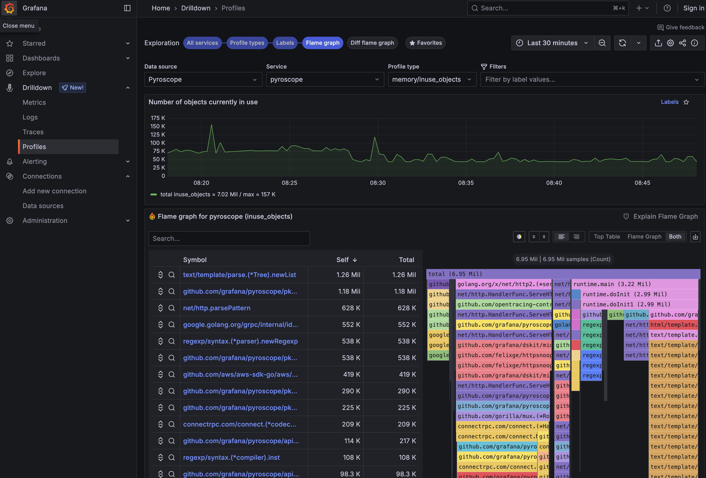

# OpenTelemetry Profiling with Grafana Pyroscope

> ⚠️ **PROOF OF CONCEPT** ⚠️
> 
> This project is a **proof-of-concept demonstration only** and is **NOT intended for production use**.
> 
> - No security hardening has been applied
> - No performance optimizations for production workloads
> - Configuration may contain insecure defaults
> - Limited error handling and monitoring
> - Not tested at scale
> 
> Use this code for learning, experimentation, and as a starting point only.

## Example Output



*Example: Grafana Pyroscope interface showing continuous profiling data from the sample Go application, including memory usage patterns and flame graph visualization.*

## Summary

This project demonstrates profiling integration with OpenTelemetry and Grafana Pyroscope on Kubernetes using pprof. It uses 
[Alloy](https://grafana.com/oss/alloy-opentelemetry-collector/) 
to scrape from pprof.

There is an attempt to expose profiling data same data as OTEL 
metrics (disabled, not functional).

This does **NOT** the proposed OTEL support for 
[profiling](https://github.com/open-telemetry/opentelemetry-specification/blob/main/oteps/profiles/0212-profiling-vision.md); 
however, this would be a viable alternative at some point.

## Prerequisites

- [Kind](https://kind.sigs.k8s.io/docs/user/quick-start/#installation)
- [Tilt](https://docs.tilt.dev/install.html)
- kubectl

## Quick Start

1. Run the setup script to create the Kind cluster:
```bash
./setup.sh
```

2. (Optional) Test your setup:
```bash
./test.sh
```

3. Start the development environment:
```bash
tilt up
```

4. Access Grafana at http://localhost:3000 (admin/admin)

5. When finished, clean up resources:
```bash
./teardown.sh
```

The environment includes:
   - Kind cluster
   - Grafana LGTM stack (Loki, Grafana, Tempo, Mimir, Pyroscope)
   - Grafana Alloy for scraping pprof endpoints
   - Sample Go application with pprof and otel-profiling-go integration

## Architecture

- **Sample App**: Go application with pprof endpoints and otel-profiling-go for trace correlation
- **Grafana Alloy**: Scrapes pprof endpoints and forwards to Pyroscope
- **Grafana LGTM**: Stores and visualizes profiles, logs, metrics, and traces
- **Pyroscope**: Integrated in LGTM for continuous profiling

## Features

- Continuous profiling with pprof (CPU, heap, goroutines)
- Trace-to-profile correlation using otel-profiling-go
- Grafana dashboards for profile visualization
- OpenTelemetry integration for distributed tracing