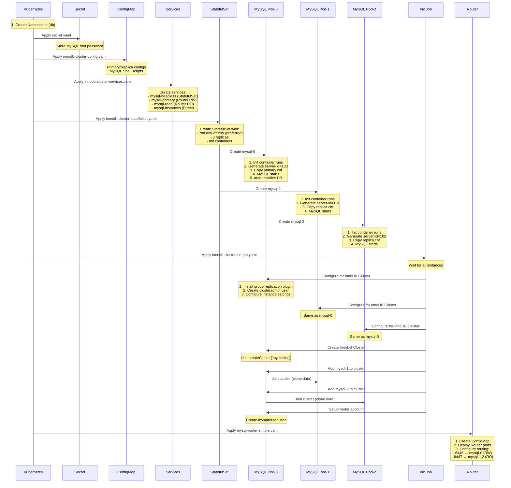

# MySQL InnoDB Cluster Deployment

This directory contains Kubernetes manifests for deploying MySQL with InnoDB Cluster support.

## Deployment Order and Configuration Flow



## File Descriptions

### 1. `secret.yaml`
- Creates the `mysql-credentials` secret
- Stores the MySQL root password
- Used by all MySQL pods and initialization jobs

### 2. `innodb-cluster-config.yaml`
ConfigMap containing:
- `primary.cnf` - MySQL configuration for the primary node
- `replica.cnf` - MySQL configuration for replica nodes
- `setup-cluster.js` - Reference MySQL Shell script (not used in current flow)
- `check-cluster.js` - MySQL Shell script to check cluster health

### 3. `innodb-cluster-services.yaml`
Creates four services:
- `mysql-headless` - Headless service for StatefulSet pod discovery
- `mysql-primary` - Points to MySQL Router port 6446 (read/write)
- `mysql-read` - Points to MySQL Router port 6447 (read-only)
- `mysql-instances` - Direct access to all MySQL instances

### 4. `innodb-cluster-statefulset.yaml`
StatefulSet configuration:
- 3 replicas with preferred pod anti-affinity
- Init container to configure server-id and copy appropriate config
- MySQL container with InnoDB Cluster prerequisites
- MySQL Shell sidecar container for administrative tasks
- PersistentVolumeClaim template for data storage

### 5. `innodb-cluster-init-job.yaml`
Kubernetes Job that:
- Waits for all MySQL instances to be ready
- Configures each instance for InnoDB Cluster using MySQL Shell
- Creates the cluster on mysql-0
- Adds mysql-1 and mysql-2 to the cluster
- Sets up router and application accounts

### 6. `mysql-router-simple.yaml`
Simplified MySQL Router deployment:
- ConfigMap with static routing configuration
- Deployment with 2 router replicas
- Routes read/write traffic to mysql-0
- Routes read-only traffic to mysql-1 and mysql-2
- No dependency on InnoDB Cluster metadata

### 7. `mysql-router.yaml`
Advanced MySQL Router deployment (requires working InnoDB Cluster):
- Bootstraps against cluster metadata
- Automatic failover support
- Dynamic routing based on cluster state
- Currently not used due to cluster initialization issues

## Common Operations

### Check MySQL Status
```bash
kubectl get pods -n db -l app=mysql
kubectl exec -n db mysql-0 -c mysql -- mysql -u root -p$MYSQL_ROOT_PASSWORD -e "SELECT @@hostname"
```

### Check Cluster Status
```bash
kubectl exec -n db mysql-0 -c mysql-shell -- mysqlsh --uri clusteradmin:ClusterAdmin123!@localhost:3306 --js -e "print(JSON.stringify(dba.getCluster().status(), null, 2))"
```

### Connect Through Router
```bash
# Read/Write connection
mysql -h localhost -P 6446 -u app -papp_password

# Read-Only connection
mysql -h localhost -P 6447 -u app -papp_password
```

### Clean and Restart
```bash
./scripts/clean-mysql.sh
kubectl apply -f k8s/mysql/innodb-cluster-config.yaml
kubectl apply -f k8s/mysql/innodb-cluster-services.yaml
kubectl apply -f k8s/mysql/innodb-cluster-statefulset.yaml
# Wait for pods to be ready
kubectl apply -f k8s/mysql/innodb-cluster-init-job.yaml
kubectl apply -f k8s/mysql/mysql-router-simple.yaml
```

## Known Issues

1. **InnoDB Cluster Initialization**: The full cluster setup has issues with MySQL Shell configuration. Currently using standalone MySQL instances with manual routing.

2. **Pod Anti-Affinity**: Changed from `required` to `preferred` to allow running on single-node Kind clusters.

3. **MySQL Router Bootstrap**: The advanced router configuration requires a working InnoDB Cluster. Using the simplified static configuration instead.

## Architecture Notes

- MySQL uses Group Replication for high availability
- Each MySQL instance has a unique server-id (100, 101, 102)
- Configuration is split between primary and replica nodes
- MySQL Router provides connection routing and load balancing
- All sensitive data (passwords) are stored in Kubernetes secrets